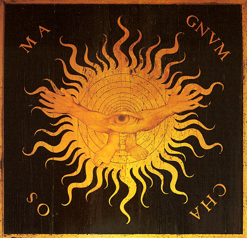

  

# Chaos

> Chaos (Ancient Greek: χάος, khaos) refers to the void state preceding the creation of the universe or cosmos in the Greek creation myths, or to the initial "gap" created by the original separation of heaven and earth.
> -- <cite>[Wikipedia][1]</cite>

[1]: https://en.wikipedia.org/wiki/Chaos_(cosmogony)
